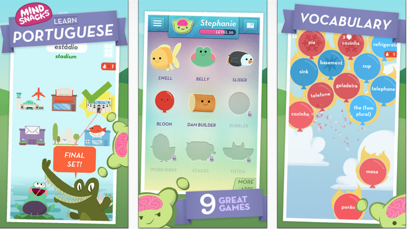

# Bagrut App

Researching an educational app for The Bagrut high school qualification.  

### The Bagrut Qualification

Te'udat Bagrut (Hebrew: תעודת בגרות‎) is a certificate which attests that a student has successfully passed Israel's high school matriculation examination. Bagrut is a prerequisite for higher education in Israel.

### Existing Resources To Help You Prepare

Resources are limited.
The [gov archives](http://cms.education.gov.il/EducationCMS/Units/Mazkirut_Pedagogit/English/Bagrut/BagrutArchives.htm
) are uninspiring.

### Pass Rates

Three quarters of Jewish 17-year-olds passed Bagrut exams in last school year, compared to less than half of Arabs.

The gap between Jewish and Arab 17-year-olds matriculating high school has grown over the last school year, now standing at 75.6 percent for Jews (excluding Haredim) and 48.4 percent for Arabs, according to Education Ministry data published Monday.

The data show a 3.3 percent increase in the total number of students, Jewish and Arab, earning a bagrut – to **56 percent**.

Read more: http://www.haaretz.com/israel-news/.premium-1.734756

### What Happens If You Don't Pass?

Without a Bagrut qualification, you will not be able to enter an Israeli university. Re-taking the Bagrut exams or catching-up after serving in the army can be costly and difficult...

There are many private colleges that offer Bagrut courses.  Courses can be taken one at a time or concurrently.  This is a very attractive solution for someone who wishes to study part-time.  But studying at one of these private colleges does not come cheap.  Budget approximately 3,000 shekels (£657) per subject.

# Users

### User Demographics

- Mainly Israeli school leavers, 16-18 y/o.

- Some will be retaking modules (54% don't pass first time).

- Some will retake after serving in the army.

### User Personas

**Name**: Afeefa

**Age**: 19

**Occupation**: Shop Assistant

**Background**: Afeefa is keen to go to University to study Biology, but she needs to retake her Bagrut. She is currently working as a Shop Assistant while studying in her free time at the local library. She can't afford to pay for extra tuition.

***

**Name**: Jaffa

**Age**: 20

**Occupation**: Unemployed (formerly in the army)

**Background**: Jaffa has just completed her military service. She now wants to gain her Bagrut qualification to improve her career prospects. She didn't pass first time round.

***

**Name**: Abed

**Age**: 17

**Occupation**: Student

**Background**: Abed is in the middle of studying for his Bagrut. He has exams in 2 months' time.

**Environment**:
Abed is at a state school, which he commutes to by bus. He spends his free time playing sports and socialising. He always has his phone with him when he is out and likes to play mobile games on the bus. At home, he uses a laptop for entertainment. He lives in a busy household with 3 younger siblings under 12.

**Frustrations/Concerns**:
Abed feels under a lot of pressure to pass the Bagrut the first time around because he wants to go to University. He gets nervous in exams and is concerned that this will affect his performance. He is frustrated by the lack of revision resources available. The resources that are available are so unnecessarily dense that they make him feel overwhelmed. He is also constantly distracted by his friends and siblings, so he finds it extra hard to apply himself.

**Wants**:
Abed wants an effective, efficient, and engaging study resource to follow over the next 2 months. The information needs to be presented in smaller chunks so that studying isn't a daunting experience, but an enjoyable journey, with lots of positive reinforcement and reassurance.

**Motivations**: Abed just wants to pass his exams so that he can go to University.

**Quote**: "Studying is so overwhelming; it just makes me more nervous... so I let myself get distracted."  

***

# Existing Solutions

## Best Language Learning Apps

### Babbel

### Busuu

### Duolingo

### HelloTalk

### HiNative

### Leaf

### Lingua

### Memrise

### MindSnacks

### MosaLingua

### Pronounce

### Triplingo

# Existing UX Research in Language Learning Apps

#### [User evaluation of language learning mobile applications: a case study with learners of Spanish](http://oro.open.ac.uk/48777/)

- "[L]earners use apps mostly for **vocabulary development, translation, and grammar practice**."
- "Apps are used often, mostly informally, and for relatively **short periods of time**. Learners like the ability to **practise specific areas, rapid access to information, ease of use, and gamification elements**, but have **concerns about reliability** and other factors."

#### Just How Effective Are Language Learning Apps? (Article in [The Conversation](http://theconversation.com/just-how-effective-are-language-learning-apps-42913))

- Around 70 million people – including Bill Gates – have signed up for the language learning app Duolingo.
- The **user is introduced to some vocabulary, and then every day they spend a few minutes doing language exercises**, such as translating sentences.
- There is a level of **adaptivity**: words that you get wrong come up again and again, while words that you get right come up less often – although they do still appear.
- As users complete the exercises successfully, they can **move up through the “levels”**, and unlock bonus lessons on “flirting” and “idioms”.
- Over time, a lot of ideas coalesced into what is generally known as the **“communicative approach”**. This catch-all label refers to methods which prioritise the function of language as communication, not structure.
- you are drilled on sentences like “I am the child”, or “I have a bowl”. This is audio-lingual drilling: there is no communication happening.
- this is where an app like Duolingo really comes into its own: **it reminds you every day to practise, and reinforce the words you have learnt, while encouraging you with virtual rewards (if that’s your thing)**.
- It can be done in the coffee queue, allowing the users to **learn without sacrificing other things in their lives**.
- **useful supplement** when you are learning a language – but not a substitute

#### [Analysing and Evaluating Current Mobile Applications for Learning English Speaking](https://englishagenda.britishcouncil.org/sites/default/files/filefield_paths/analysing_and_evaluating_current_mobile_applications_v2.pdf)

-  Results have shown that behaviourist learning theory is the dominant theory underpinning the current mobile apps for English speaking learning, considering that **drill and practices are the most popular activities in these
apps**.
-  Through analysing
the interview data, all the participants reported that they **used the apps at different
time during the day** and at different places, such as at home, at work, or while
commuting. The majority of them used the apps mostly at home. Participants who
work on weekdays sometimes used the apps at workplace after lunchtime.
- **learners need a quiet and
stress-free place to practice speaking**. However, with the advantage of mobility of
mobile devices, learning could also happen at many other places wherever
convenient.
- it only took a short time for
using the apps each time, **from several minutes to around twenty minutes**.
- Firstly, the participants found it very flexible using mobile apps for English
language learning since they could easily access to the learning materials anytime
and anywhere.
- these learning apps fitted their personal needs well. **They could choose topics that
suit their personal interests or needs** from a variety of situated conversations that the
apps provided.
- Apps that provide e-lessons also **divide each
lesson into several units**.
-  most of the apps only provide **bit-size chunks** of input rather extended
tasks.
-  the small amount of information data appears particularly
fit the mobile lifestyle of nowadays learners.
- current mobile
apps for learning English speaking could be grouped into five categories:
pronunciation, conversation, video lesson, reference, and authentic content.

#### 6 Tips For Creating A Language Learning App, [Sitepoint](https://www.sitepoint.com/6-tips-creating-language-learning-app/)

- Create a means for users to use your tools **in response to their specific needs**.
- Some of the newest and most successful language apps are those which **incorporate real time face to face tools**

#### From Busuu to Babbel..., article in [The Guardian](https://www.theguardian.com/small-business-network/2017/mar/07/busuu-babble-language-learning-startups-adapt-thrive)

- Busuu began as a website before launching an app in 2010. Now **80% of users access it on mobile devices**.

#### [Language Learning With Duolingo] (https://multilingual.com/conversational-user-experience-language-angle-duolingo/)

- Duolingo’s got it all going on really from a UX perspective. It’s **free, fun, global, local, social, all about mobility from the cloud, includes gamification, is powered by the crowd, packs voice interaction, and now bots too**. A bot is ideal for language learning conversational interaction, of course (though the bot feature is not available in every Duolingo language option)

## Research Conclusion: What Are The Key Factors to Consider For Lean Development?

- Mobile first.
- Think: fun, social, accessible.
- Rapid access to specific topics important so that users can choose what they need to work on.
- Learners like to choose a topic they are interested in.
- Bite-sized chunks of information rather than extended tasks.
- A sense of (gamified?) progression (e.g. levels) helps motivate the user and is a good way to structure information.
- Accuracy of information is important to retain user's trust.
- Time and context for use: from a few minutes to 20 minutes, at any time, anywhere. Users can learn without sacrificing anything else in their lives.
- Adaptivity can be used to tailor the app to suit the user's needs.
- Drill and practice is the most popular activity in LL apps.
- Fresh, bright colours: mainly blue and orange, some green.

# User Flow

The content for BagrutApp is quite high level Arabic, all the more reason to break it down into chunks...

(Please note that this is based on a translation into English, which may contain small misunderstandings.)

#### 1. Welcome Page
#### 2. Choose Topic > Morphology
#### 3. Select Stage/Level*:

#### 3a. Morphology
- Intro to morphology
- The morphological balance and verbs
- Examples

##### Trilateral/Quadrilateral Verbs
- Trilateral and quadrilateral verbs
- Additional trilateral verbs
- Additional trilateral verbs

##### Recognise Verb Conjunction
- How to recognise verb conjunction (morphology)

##### Summary
- Summary of morphological balance and verbs

#### 3b. The Verbal Noun

##### Types

- The verbal noun (Masdar Sarah)
- The verbal noun (Masadir Qiyasiya)

##### Differentiating

- Differentiating between verbal nouns
- The infinitive

#### 3c. Derivatives

##### Intro

- Intro to derivatives
- Examples
- The active participle
- Articulation/wording
- Trilateral hollow verb modal
- Other

##### Exaggeration
- Exaggeration forms (hyperbole)

##### Adjectives & Past Participles
- resembling adjective (intro, examples, irregulars)
- passive participle (examples)

##### Utilitarian Noun
- Utilitarian noun

##### Time and Place
- Name of time
- Name of place

#### 4. Assessment: Exercises in morphology (verbal nouns, derivatives, paradigms of morphology)
- Results/Progress page

 * At end of each stage/level, user has option to go straight to Assessment, or continue to next lesson/level/stage. Results/Progress page is accessible for showing what user needs to focus on.

# Prototyping

A monochrome prototype for trialling the user flow.

# Color

### [Psychology of Colour In The Education Environment](http://www.colorobjects.com/en/color-columns/the-colour-real/item/357-psychology-of-colour-in-the-educational-environment.html)

- Mature students gravitate towards the **cooler side** of the colour wheel (blue/green/mauve)
- **Blues** are calming and promote concentration
- **Gentle yellows** are great for languages and creative pursuits

### [6 Ways Colour Psychology Can Be Used to Design Effective eLearning](http://info.shiftelearning.com/blog/bid/348188/6-Ways-Color-Psychology-Can-Be-Used-to-Design-Effective-eLearning)

- **Colour reduces boredom** and passivity. Use colour to increase attention span. Especially red. Use strategically.
- Use colors based on their meanings to stimulate associations and improve recall.
- **In eLearning, it is typically best to stick to a colour scheme that uses three tones.** Interesting but not overwhelming.
- **Use the 60-30-10 rule for colour use.**

### 3 Colour Triads made with [Adobe](https://color.adobe.com/create/color-wheel/)

# Typography  

- [Studies](http://www.nytimes.com/2011/04/19/health/19mind.html) have shown that font size has no effect on memory, but font style does.
- There are key considerations to take into account when designing Arabic typography. [Arabnet](http://news.arabnet.me/3-key-things-consider-when-designing-arabic-typeface/) has a useful guide.
- [Google fonts](https://fonts.google.com/?subset=arabic&category=Serif,Sans+Serif,Display,Handwriting&selection.family=Lateef) has a comprehensive selection of open source fonts for Arabic typeface.
- Our Product Owners are teachers and have provided a list of suitable fonts.
